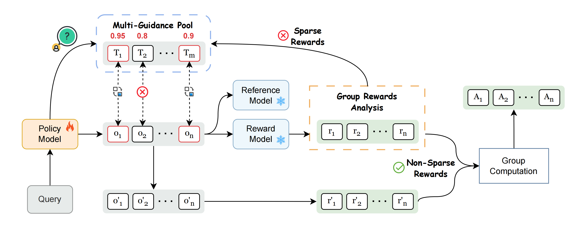
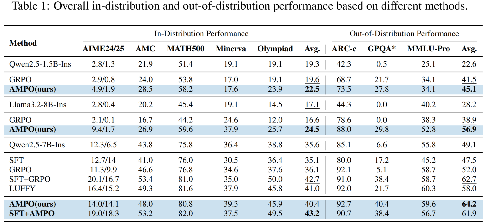

<h1 align="center"> More Than One Teacher: Adaptive Multi-Guidance Policy Optimization for Diverse Exploration</h1>

<h5 align="center"> If you like our project, please give us a star ⭐ on GitHub for the latest update.</h5>

# ✨Getting Started

## Installation

You can install AMPO dependencies by running the following commands:
```bash
conda create -n ampo python=3.10
conda activate ampo
cd ampo
cd verl
# Make sure you have activated verl conda env
# If you need to run with megatron
# bash scripts/install_vllm_sglang_mcore.sh
# Or if you simply need to run with FSDP
USE_MEGATRON=0 bash scripts/install_vllm_sglang_mcore.sh
cd ..
pip install -r requirements.txt
```

## Repo Structure

This repository includes:

- `ampo`: Codes for training AMPO, intelligently leverages guidance from multiple, diverse teacher models. Our main code changes are in ampo/verl/verl/adaptive_mix_src.
- `dataset`: Dataset for training and evaluating AMPO. 
- `examples`: Example script to train AMPO.
- `eval_scripts`: Evaluation scripts.

---

# Introduction

**AMPO**, a novel framework that intelligently leverages guidance from multiple, diverse teacher models, intervening only when the on-policy model fails. Our two core contributions, Adaptive Multi-Guidance Replacement and Comprehension-based Guidance Selection, ensure that this external knowledge is used both efficiently and effectively.



### Key Highlights:
- **Adaptive Multi-Guidance Replacement**: Minimizes intervention by providing external guidance only upon complete on-policy failure, preserving self-discovery while enhancing reasoning efficiency.
- **Comprehension-based Guidance Selection**: Improves learning effectiveness by guiding the model to assimilate the most comprehensible external solutions, demonstrably boosting performance.
- **Superior Performance:** Achieves better performance and efficiency compared to using RL or SFT alone.
- 
### Main Evaluation Results

---

# Usage

## Data Preparation
You need to first run the data preparation script to get the training data in parquet format.
```bash
cd data
python prepare_train.py
```

## Model Preparation
You need to first download Qwen/Qwen2.5-7B-Instruct, Qwen/Qwen2.5-1.5B-Instruct, meta-llama/Meta-Llama-3-8B-Instruct. 

## Training
You can run the following command to train AMPO/GRPO for different base models:

```bash
  bash exp_scripts/train_ampo.sh
  bash exp_scripts/train_grpo.sh
```

## Eval
You can eval models by running the following commands:
```bash
bash eval_scripts/run_eval.sh # For common eval
bash eval_scripts/run_eval_pass_k.sh # For eval pss_at_k
```
## Evaluation
We provide scripts to evalute. You can evaluate using the following command:

```bash
bash eval_scripts/run_eval.sh # For common eval
bash eval_scripts/run_eval_pass_k.sh # For eval pss_at_k
```

## Inference

Here’s an example of using AMPO for inference:

<details>
<summary>Click to view inference example</summary>

```python
from transformers import AutoTokenizer
from vllm import LLM, SamplingParams

model_path="SII-Enigma/Qwen2.5-7B-Ins-AMPO"

question = "which number is larger? 9.11 or 9.9?"

tokenizer = AutoTokenizer.from_pretrained(model_path)
messages = [{"role": "user", "content": question}]
chat = tokenizer.apply_chat_template(messages, tokenize=False, add_generation_prompt=True)

llm = LLM(model=model_path)
params = SamplingParams(temperature=0.6, max_tokens=8192)
outputs = llm.generate([chat], params)
print(outputs[0].outputs[0].text)
```

</details>

## Models

| **Model** | **Base Models** |
|-----------|----------------|
| SII-Enigma/Qwen2.5-7B-Ins-AMPO  [Link](https://huggingface.co/SII-Enigma/Qwen2.5-7B-Ins-AMPO) | Qwen2.5-7B-Instruct  [Link](https://huggingface.co/Qwen/Qwen2.5-7B-Instruct) |
| SII-Enigma/Qwen2.5-1.5B-Ins-AMPO  [Link](https://huggingface.co/SII-Enigma/Qwen2.5-1.5B-Ins-AMPO) | Qwen2.5-1.5B-Instruct  [Link](https://huggingface.co/Qwen/Qwen2.5-7B-Instruct) |
| SII-Enigma/Llama3.2-8B-Ins-AMPO  [Link](https://huggingface.co/SII-Enigma/Llama3.2-8B-Ins-AMPO) | Llama-3.2-8B-Instruct  [Link](https://modelscope.cn/models/voidful/Llama-3.2-8B-Instruct) |

# Acknowledgement

AMPO builds upon [LUFFY](https://github.com/ElliottYan/LUFFY), [veRL](https://github.com/volcengine/verl), [RLPR](https://github.com/OpenBMB/RLPR) and utilizes [vLLM](https://github.com/vllm-project/vllm) for inference. We utilize [Math-Verify](https://github.com/huggingface/Math-Verify) for math reasoning evaluation. We thank the open-source community for codes, datasets and backbones.
